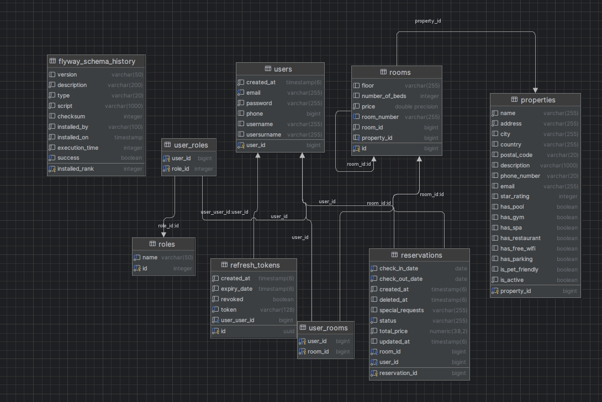
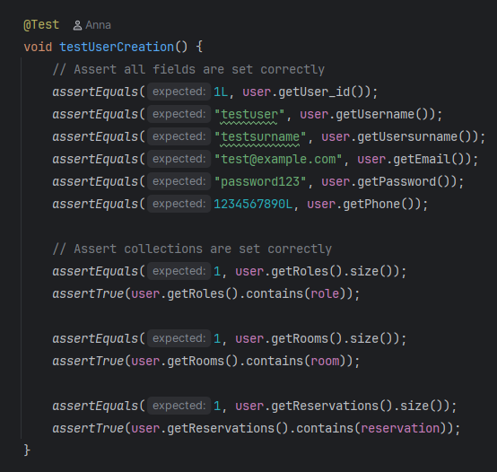
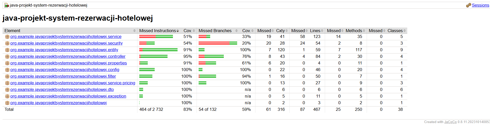
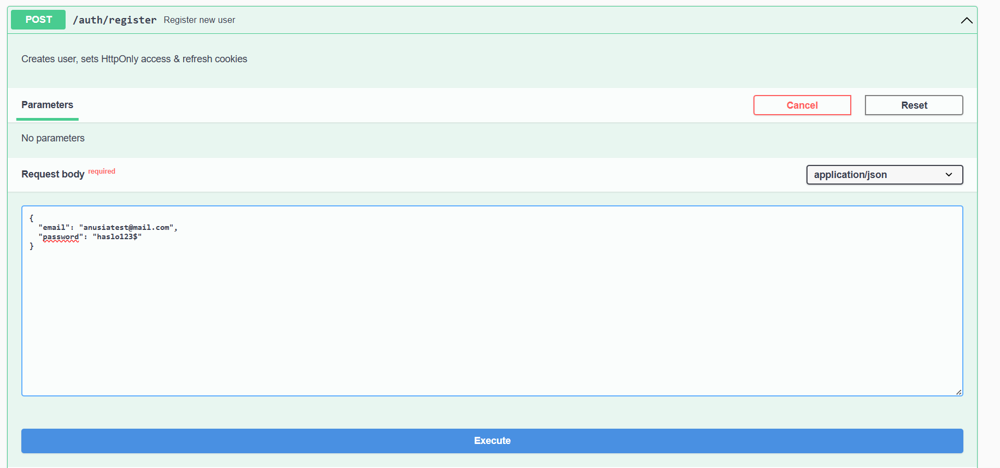
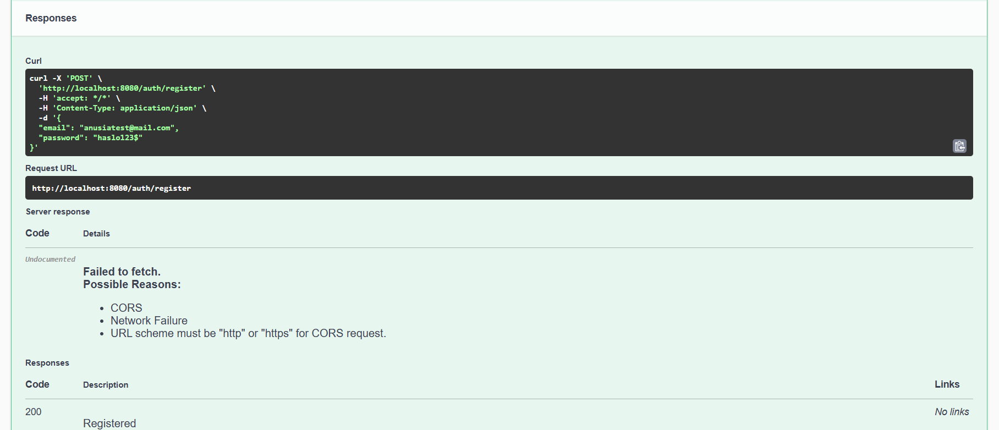
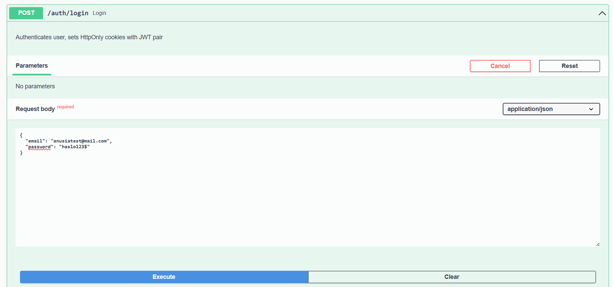
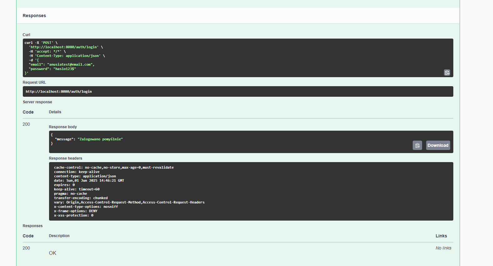
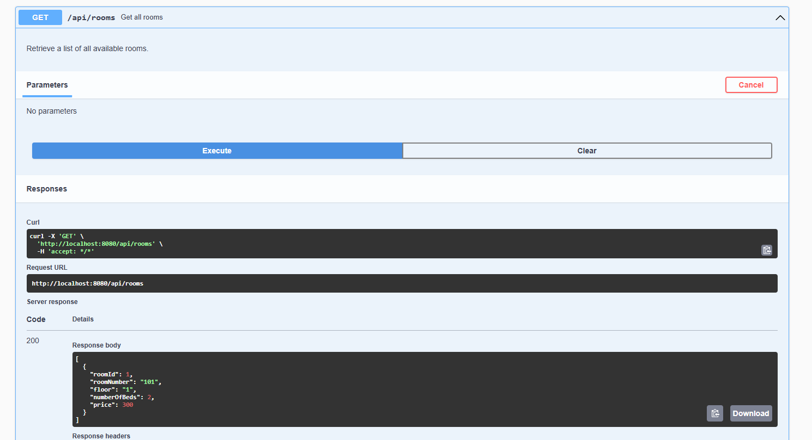
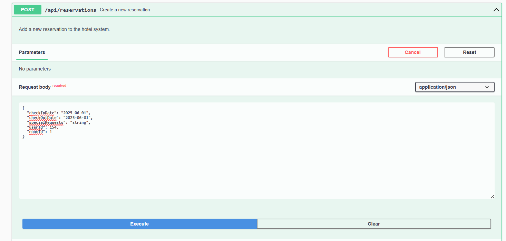
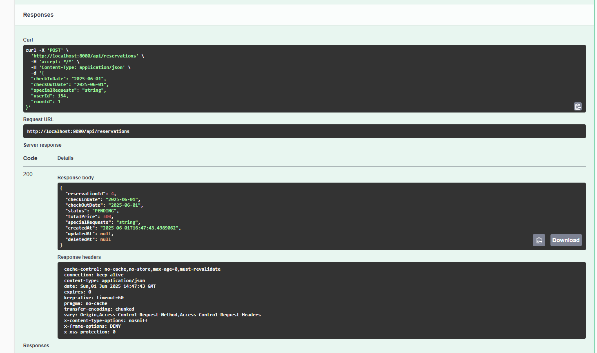

# System Rezerwacji Hotelowej

## 1. Temat
System Rezerwacji Hotelowej - aplikacja webowa do zarządzania rezerwacjami pokoi hotelowych.

## 2. Opis
System Rezerwacji Hotelowej to kompleksowa aplikacja webowa zbudowana przy użyciu Spring Boot, która umożliwia zarządzanie rezerwacjami pokoi hotelowych. Aplikacja oferuje funkcjonalności takie jak rejestracja i logowanie użytkowników, przeglądanie dostępnych pokoi, dokonywanie rezerwacji, zarządzanie rezerwacjami oraz administrowanie systemem.

Główne funkcjonalności systemu:
- Rejestracja i logowanie użytkowników
- Przeglądanie dostępnych pokoi
- Dokonywanie rezerwacji pokoi
- Zarządzanie rezerwacjami (anulowanie, modyfikacja)
- Różne strategie wyceny pokoi
- Zarządzanie użytkownikami i ich uprawnieniami
- Zabezpieczenia oparte na rolach

## 3. Realizowane systemy
System realizuje następujące podsystemy:

### System autentykacji i autoryzacji użytkowników (JWT)
- Implementuje mechanizm uwierzytelniania oparty na tokenach JWT (JSON Web Token)
- Zapewnia bezpieczne logowanie i rejestrację użytkowników
- Wykorzystuje tokeny odświeżania (refresh tokens) do przedłużania sesji użytkowników
- Implementuje mechanizm kontroli dostępu oparty na rolach (RBAC)
- Wykorzystuje programowanie aspektowe (AOP) do kontroli dostępu do zasobów
- Zapewnia hashowanie haseł przy użyciu algorytmu BCrypt

### System zarządzania pokojami hotelowymi
- Umożliwia dodawanie, usuwanie i modyfikację pokoi hotelowych
- Zapewnia wyszukiwanie pokoi według różnych kryteriów (dostępność, cena, liczba łóżek)
- Zarządza statusem dostępności pokoi
- Przechowuje informacje o wyposażeniu i udogodnieniach pokoi

### System rezerwacji pokoi
- Umożliwia tworzenie, anulowanie i modyfikację rezerwacji
- Weryfikuje dostępność pokoi w wybranym terminie
- Zarządza statusem rezerwacji (potwierdzona, anulowana, zrealizowana)
- Obsługuje specjalne wymagania gości
- Generuje potwierdzenia rezerwacji

### System wyceny pokoi (z różnymi strategiami cenowymi)
- Implementuje wzorzec projektowy Strategia do elastycznego obliczania cen
- Oferuje różne strategie wyceny (standardowa, z rabatem, sezonowa)
- Wykorzystuje fabrykę strategii do dynamicznego wyboru odpowiedniej strategii cenowej
- Uwzględnia różne czynniki przy wycenie (długość pobytu, sezon, dostępność)

### System zarządzania użytkownikami i rolami
- Zarządza kontami użytkowników (klienci, administratorzy, menedżerowie)
- Implementuje hierarchię ról z różnymi poziomami uprawnień
- Umożliwia przypisywanie i odbieranie ról użytkownikom
- Przechowuje i zarządza danymi osobowymi użytkowników

### System obsługi błędów i wyjątków
- Zapewnia globalną obsługę wyjątków w aplikacji
- Zwraca ustandaryzowane komunikaty błędów w formacie JSON
- Loguje błędy i wyjątki dla celów diagnostycznych
- Obsługuje różne rodzaje błędów (walidacji, biznesowe, techniczne)

### System dokumentacji API
- Generuje interaktywną dokumentację API przy użyciu Swagger/OpenAPI
- Umożliwia testowanie endpointów bezpośrednio z interfejsu dokumentacji
- Dostarcza szczegółowe opisy parametrów, odpowiedzi i kodów błędów
- Grupuje endpointy według funkcjonalności

## 4. Struktura projektu
Projekt jest zorganizowany zgodnie z architekturą warstwową:
- Warstwa prezentacji (kontrolery REST)
- Warstwa biznesowa (serwisy)
- Warstwa dostępu do danych (repozytoria)
- Warstwa modelu danych (encje)

Projekt wykorzystuje Spring Boot jako główny framework, wraz z:
- Spring Security do zabezpieczeń
- Spring Data JPA do dostępu do bazy danych
- JWT do autentykacji
- Hibernate jako ORM
- PostgreSQL jako bazę danych
- Docker do konteneryzacji


```
java-projekt-system-rezerwacji-hotelowej/
├── .idea/                           # Katalog konfiguracyjny IntelliJ IDEA
├── .mvn/                            # Katalog konfiguracyjny Maven Wrapper
├── src/                             # Kod źródłowy projektu
│   ├── main/                        # Główny kod aplikacji
│   │   ├── java/                    # Kod Java
│   │   │   └── org/example/javaprojektsystemrezerwacjihotelowej/
│   │   │       ├── config/          # Konfiguracja aplikacji
│   │   │       ├── controller/      # Kontrolery REST
│   │   │       ├── dto/             # Obiekty transferu danych
│   │   │       ├── entity/          # Encje bazodanowe
│   │   │       ├── exception/       # Obsługa wyjątków
│   │   │       ├── filter/          # Filtry HTTP
│   │   │       ├── properties/      # Właściwości konfiguracyjne
│   │   │       ├── repository/      # Repozytoria danych
│   │   │       ├── security/        # Komponenty bezpieczeństwa
│   │   │       ├── service/         # Serwisy biznesowe
│   │   │       │   └── pricing/     # Strategie wyceny
│   │   │       └── JavaProjektSystemRezerwacjiHotelowejApplication.java  # Klasa główna aplikacji
│   │   └── resources/               # Zasoby aplikacji
│   │       ├── db/                  # Skrypty bazodanowe
│   │       ├── application.properties        # Główna konfiguracja
│   │       └── application-docker.properties # Konfiguracja dla Dockera
│   └── test/                        # Testy
│       ├── java/                    # Testy Java
│       │   └── org/example/javaprojektsystemrezerwacjihotelowej/
│       │       ├── config/          # Testy konfiguracji
│       │       ├── controller/      # Testy kontrolerów
│       │       ├── dto/             # Testy obiektów DTO
│       │       ├── entity/          # Testy encji
│       │       ├── exception/       # Testy obsługi wyjątków
│       │       ├── filter/          # Testy filtrów
│       │       ├── properties/      # Testy właściwości
│       │       ├── repository/      # Testy repozytoriów
│       │       ├── security/        # Testy bezpieczeństwa
│       │       ├── service/         # Testy serwisów
│       │       └── JavaProjektSystemRezerwacjiHotelowejApplicationTests.java  # Testy klasy głównej
│       └── resources/               # Zasoby testowe
├── target/                          # Skompilowane pliki i artefakty
├── .dockerignore                    # Pliki ignorowane przez Docker
├── .gitattributes                   # Konfiguracja atrybutów Git
├── .gitignore                       # Pliki ignorowane przez Git
├── docker-compose.yml               # Konfiguracja Docker Compose
├── Dockerfile                       # Definicja obrazu Docker
├── HELP.md                          # Plik pomocy
├── mvnw                             # Maven Wrapper (Unix)
├── mvnw.cmd                         # Maven Wrapper (Windows)
├── pom.xml                          # Konfiguracja projektu Maven
├── README.md                        # Dokumentacja projektu
├── test-docker.ps1                  # Skrypt testowy Docker (PowerShell)
└── test-docker.sh                   # Skrypt testowy Docker (Bash)
```


## 5. Diagram ERD


## 6. Tabele bazodanowe
System wykorzystuje następujące tabele w bazie danych:

### Tabela `users`
- **Opis**: Przechowuje informacje o użytkownikach systemu
- **Klucz główny**: `user_id` (auto-inkrementowany)
- **Pola**:
  - `username` - nazwa użytkownika
  - `usersurname` - nazwisko użytkownika
  - `email` - adres email (unikalny, wymagany)
  - `password` - hasło użytkownika (hashowane, wymagane)
  - `phone` - numer telefonu
  - `created_at` - data utworzenia konta (automatycznie ustawiana)
- **Relacje**:
  - Wiele-do-wielu z `roles` poprzez tabelę łączącą `user_roles`
  - Jeden-do-wielu z `reservations` (użytkownik może mieć wiele rezerwacji)
  - Wiele-do-wielu z `rooms` poprzez tabelę łączącą `user_rooms`
- **Ograniczenia**:
  - Email musi być unikalny
  - Hasło i email są wymagane

### Tabela `roles`
- **Opis**: Przechowuje role użytkowników w systemie
- **Klucz główny**: `id` (auto-inkrementowany)
- **Pola**:
  - `name` - nazwa roli (enum: USER, ADMIN, MENAGER)
- **Relacje**:
  - Wiele-do-wielu z `users` poprzez tabelę łączącą `user_roles`
- **Ograniczenia**:
  - Nazwa roli musi być unikalna i nie może być pusta

### Tabela `user_roles`
- **Opis**: Tabela łącząca użytkowników z rolami (relacja wiele-do-wielu)
- **Klucze obce**:
  - `user_id` - referencja do tabeli `users`
  - `role_id` - referencja do tabeli `roles`

### Tabela `rooms`
- **Opis**: Przechowuje informacje o pokojach hotelowych
- **Klucz główny**: `room_id` (auto-inkrementowany)
- **Pola**:
  - `room_number` - numer pokoju (wymagany)
  - `floor` - piętro, na którym znajduje się pokój
  - `number_of_beds` - liczba łóżek w pokoju (wymagana)
  - `price` - cena za noc
- **Relacje**:
  - Jeden-do-wielu z `reservations` (pokój może mieć wiele rezerwacji)
  - Wiele-do-wielu z `users` poprzez tabelę łączącą `user_rooms`

### Tabela `user_rooms`
- **Opis**: Tabela łącząca użytkowników z pokojami (relacja wiele-do-wielu)
- **Klucze obce**:
  - `user_id` - referencja do tabeli `users`
  - `room_id` - referencja do tabeli `rooms`

### Tabela `reservations`
- **Opis**: Przechowuje informacje o rezerwacjach pokoi
- **Klucz główny**: `reservation_id` (auto-inkrementowany)
- **Pola**:
  - `check_in_date` - data zameldowania (wymagana)
  - `check_out_date` - data wymeldowania (wymagana)
  - `status` - status rezerwacji (np. PENDING, CONFIRMED, CANCELLED)
  - `total_price` - całkowita cena rezerwacji (wymagana)
  - `special_requests` - specjalne prośby gościa
  - `created_at` - data utworzenia rezerwacji (automatycznie ustawiana)
  - `updated_at` - data ostatniej aktualizacji rezerwacji
  - `deleted_at` - data usunięcia rezerwacji (dla miękkiego usuwania)
- **Relacje**:
  - Wiele-do-jednego z `users` (wiele rezerwacji może należeć do jednego użytkownika)
  - Wiele-do-jednego z `rooms` (wiele rezerwacji może dotyczyć jednego pokoju)
- **Ograniczenia**:
  - Daty zameldowania i wymeldowania są wymagane
  - Status i cena całkowita są wymagane
  - Użytkownik i pokój są wymagane (not null)

### Tabela `refresh_tokens`
- **Opis**: Przechowuje tokeny odświeżania dla użytkowników
- **Klucz główny**: `id` (UUID)
- **Pola**:
  - `token` - wartość tokenu odświeżania (unikalna, wymagana)
  - `expiry_date` - data wygaśnięcia tokenu (wymagana)
  - `revoked` - czy token został unieważniony (domyślnie false)
  - `created_at` - data utworzenia tokenu (automatycznie ustawiana)
- **Relacje**:
  - Wiele-do-jednego z `users` (wiele tokenów może należeć do jednego użytkownika)
- **Ograniczenia**:
  - Token musi być unikalny
  - Data wygaśnięcia jest wymagana
  - Użytkownik jest wymagany (not null)

## 7. Pakiety główne
Projekt jest podzielony na następujące pakiety, które odzwierciedlają architekturę warstwową aplikacji:

### Pakiet `config`
- **Opis**: Zawiera klasy konfiguracyjne odpowiedzialne za ustawienia różnych aspektów aplikacji
- **Główne klasy**:
  - `SecurityConfig` - konfiguracja zabezpieczeń Spring Security, definiuje reguły dostępu do zasobów
  - `OpenApiConfig` - konfiguracja dokumentacji OpenAPI/Swagger
  - `PasswordConfig` - konfiguracja hashowania haseł (BCrypt)
  - `DataInitializer` - inicjalizacja danych testowych w bazie danych
- **Interakcje**: Klasy konfiguracyjne są używane przez Spring do inicjalizacji i konfiguracji aplikacji
- **Wzorce projektowe**: Singleton (beany Spring)

### Pakiet `controller`
- **Opis**: Zawiera kontrolery REST, które definiują endpointy API i obsługują żądania HTTP
- **Główne klasy**:
  - `AuthController` - zarządzanie autentykacją (rejestracja, logowanie, odświeżanie tokenów)
  - `RoomController` - zarządzanie pokojami (dodawanie, usuwanie, wyszukiwanie)
  - `ReservationController` - zarządzanie rezerwacjami (tworzenie, anulowanie, modyfikacja)
  - `ExampleController` - przykładowe endpointy demonstracyjne
- **Interakcje**: Kontrolery korzystają z serwisów do wykonywania operacji biznesowych i zwracają odpowiedzi HTTP
- **Wzorce projektowe**: MVC (Model-View-Controller), Wstrzykiwanie zależności

### Pakiet `dto`
- **Opis**: Zawiera obiekty transferu danych (Data Transfer Objects) używane do komunikacji między warstwami
- **Główne klasy**:
  - `LoginRequest` - dane logowania użytkownika
  - `RegistrationRequest` - dane rejestracji nowego użytkownika
  - `ReservationDTO` - dane rezerwacji
  - `RoomDTO` - dane pokoju
  - `AuthResponse` - odpowiedź zawierająca token JWT
- **Interakcje**: DTO są używane do przekazywania danych między kontrolerami a serwisami oraz do serializacji/deserializacji JSON
- **Wzorce projektowe**: DTO (Data Transfer Object)

### Pakiet `entity`
- **Opis**: Zawiera encje JPA reprezentujące tabele w bazie danych
- **Główne klasy**:
  - `User` - encja użytkownika
  - `Role` - encja roli
  - `RoleName` - enum definiujący dostępne role (USER, ADMIN, MENAGER)
  - `Room` - encja pokoju
  - `Reservation` - encja rezerwacji
  - `RefreshToken` - encja tokenu odświeżania
- **Interakcje**: Encje są używane przez repozytoria do operacji na bazie danych
- **Wzorce projektowe**: Active Record, Builder (Lombok)

### Pakiet `exception`
- **Opis**: Zawiera klasy do obsługi wyjątków i błędów w aplikacji
- **Główne klasy**:
  - `GlobalExceptionHandler` - globalny handler wyjątków dla całej aplikacji
  - `ApiException` - bazowa klasa dla wyjątków biznesowych
- **Interakcje**: Handlery wyjątków przechwytują wyjątki rzucane w aplikacji i konwertują je na odpowiednie odpowiedzi HTTP
- **Wzorce projektowe**: Chain of Responsibility

### Pakiet `filter`
- **Opis**: Zawiera filtry HTTP używane w procesie przetwarzania żądań
- **Główne klasy**:
  - `JwtAuthenticationFilter` - filtr uwierzytelniający tokeny JWT
- **Interakcje**: Filtry są wykonywane przed kontrolerami i mogą modyfikować żądania/odpowiedzi
- **Wzorce projektowe**: Chain of Responsibility, Interceptor

### Pakiet `properties`
- **Opis**: Zawiera klasy konfiguracyjne do wczytywania właściwości z plików properties
- **Główne klasy**:
  - `JwtProperties` - właściwości konfiguracyjne dla JWT (sekret, czas wygaśnięcia)
- **Interakcje**: Klasy properties są wstrzykiwane do serwisów, które potrzebują dostępu do konfiguracji
- **Wzorce projektowe**: Wstrzykiwanie zależności

### Pakiet `repository`
- **Opis**: Zawiera interfejsy repozytoriów Spring Data JPA do operacji na bazie danych
- **Główne klasy**:
  - `UserRepository` - operacje na użytkownikach
  - `RoleRepository` - operacje na rolach
  - `RoomRepository` - operacje na pokojach
  - `ReservationsRepository` - operacje na rezerwacjach
  - `RefreshTokenRepository` - operacje na tokenach odświeżania
- **Interakcje**: Repozytoria są używane przez serwisy do wykonywania operacji CRUD na encjach
- **Wzorce projektowe**: Repository, DAO (Data Access Object)

### Pakiet `security`
- **Opis**: Zawiera klasy związane z bezpieczeństwem i kontrolą dostępu
- **Główne klasy**:
  - `RoleBasedAccess` - adnotacja do oznaczania metod wymagających określonych ról
  - `RoleBasedAccessAspect` - aspekt implementujący logikę kontroli dostępu opartą na rolach
- **Interakcje**: Aspekty bezpieczeństwa są wykonywane przed metodami oznaczonymi odpowiednimi adnotacjami
- **Wzorce projektowe**: AOP (Aspect-Oriented Programming), Decorator

### Pakiet `service`
- **Opis**: Zawiera serwisy implementujące logikę biznesową aplikacji
- **Główne klasy**:
  - `AuthService` - logika autentykacji i autoryzacji
  - `JwtService` - generowanie i walidacja tokenów JWT
  - `RefreshTokenService` - zarządzanie tokenami odświeżania
  - `RoomService` - zarządzanie pokojami
  - `ReservationService` - zarządzanie rezerwacjami
- **Interakcje**: Serwisy są używane przez kontrolery i mogą korzystać z repozytoriów i innych serwisów
- **Wzorce projektowe**: Fasada, Wstrzykiwanie zależności, Singleton (beany Spring)

#### Podpakiet `service.pricing`
- **Opis**: Zawiera implementacje różnych strategii wyceny pokoi
- **Główne klasy**:
  - `PricingStrategy` - interfejs definiujący kontrakt dla strategii wyceny
  - `StandardPricingStrategy` - standardowa strategia wyceny
  - `DiscountPricingStrategy` - strategia wyceny z rabatem
  - `PricingStrategyFactory` - fabryka strategii wyceny
- **Interakcje**: Strategie wyceny są używane przez ReservationService do obliczania cen rezerwacji
- **Wzorce projektowe**: Strategia, Fabryka

## 8. Kontrolery
System zawiera następujące kontrolery REST, które udostępniają API aplikacji:

### AuthController
- **Opis**: Zarządza procesami autentykacji i autoryzacji użytkowników
- **Ścieżka bazowa**: `/auth`
- **Endpointy**:
  - `POST /auth/register` - rejestracja nowego użytkownika
  - `POST /auth/login` - logowanie użytkownika
  - `POST /auth/refresh` - odświeżanie tokenu JWT
  - `POST /auth/logout` - wylogowanie użytkownika
  - `GET /auth/me` - informacje o aktualnie zalogowanym użytkowniku
- **Bezpieczeństwo**: Wykorzystuje tokeny JWT przechowywane w ciasteczkach HTTP-only
- **Szczegóły implementacji**: Kontroler używa serwisu `AuthService` do wykonywania operacji biznesowych i zwraca odpowiedzi HTTP z odpowiednimi nagłówkami i ciałem

### RoomController
- **Opis**: Zarządza pokojami hotelowymi
- **Ścieżka bazowa**: `/api/rooms`
- **Endpointy**:
  - `GET /api/rooms` - pobieranie wszystkich pokoi (dostępne dla wszystkich ról)
  - `GET /api/rooms/{id}` - pobieranie pokoju o określonym ID (dostępne dla wszystkich ról)
  - `POST /api/rooms` - dodawanie nowego pokoju (tylko ADMIN)
  - `PUT /api/rooms/{id}` - aktualizacja istniejącego pokoju (tylko ADMIN)
  - `DELETE /api/rooms/{id}` - usuwanie pokoju (tylko ADMIN)
  - `GET /api/rooms/available` - wyszukiwanie dostępnych pokoi według dat i liczby łóżek (dostępne dla wszystkich ról)
- **Bezpieczeństwo**: Wykorzystuje adnotację `@RoleBasedAccess` do kontroli dostępu opartej na rolach
- **Szczegóły implementacji**: Kontroler używa serwisu `RoomService` do wykonywania operacji na pokojach

### ReservationController
- **Opis**: Zarządza rezerwacjami pokoi
- **Ścieżka bazowa**: `/api/reservations`
- **Endpointy**:
  - `GET /api/reservations` - pobieranie wszystkich rezerwacji (tylko ADMIN i MENAGER)
  - `POST /api/reservations` - tworzenie nowej rezerwacji (ADMIN i USER, przy czym USER może tworzyć rezerwacje tylko dla siebie)
  - `PUT /api/reservations/{id}` - aktualizacja istniejącej rezerwacji (ADMIN lub właściciel rezerwacji)
  - `DELETE /api/reservations/{id}` - anulowanie rezerwacji (ADMIN, MENAGER lub właściciel rezerwacji)
- **Bezpieczeństwo**: Łączy deklaratywną kontrolę dostępu (`@RoleBasedAccess`) z programistyczną weryfikacją właściciela zasobu
- **Szczegóły implementacji**: Kontroler używa serwisów `ReservationService` i `RoomService` oraz repozytorium `UserRepository`

### ExampleController
- **Opis**: Zawiera przykładowe endpointy demonstracyjne pokazujące różne sposoby wykorzystania kontroli dostępu
- **Ścieżka bazowa**: `/example`
- **Endpointy**:
  - `GET /example/admin-only` - dostępny tylko dla administratorów
  - `GET /example/admin-or-manager` - dostępny dla administratorów i menedżerów
  - `GET /example/user-resource/{id}` - dostępny dla właściciela zasobu lub administratorów
  - `PUT /example/manager-confirm/{id}` - pozwala menedżerom potwierdzać rezerwacje
  - `DELETE /example/cancel-reservation/{id}` - pozwala użytkownikom anulować własne rezerwacje lub administratorom/menedżerom anulować dowolne rezerwacje
- **Bezpieczeństwo**: Demonstruje różne konfiguracje adnotacji `@RoleBasedAccess`
- **Szczegóły implementacji**: Kontroler zawiera szczegółowe komentarze wyjaśniające działanie każdego endpointu

## 9. Polimorfizm
W projekcie polimorfizm jest wykorzystywany w wielu miejscach, co zwiększa elastyczność, rozszerzalność i modularność kodu:

### Polimorfizm przez implementację interfejsów
- **Strategie wyceny pokoi**:
  - Interfejs `PricingStrategy` definiuje kontrakt dla różnych strategii wyceny (`calculatePrice`, `getStrategyName`)
  - Klasa `StandardPricingStrategy` implementuje strategię standardową (cena = liczba dni * cena pokoju)
  - Klasa `DiscountPricingStrategy` implementuje strategię z rabatem (rabat rośnie wraz z długością pobytu)
  - Nowe strategie wyceny można dodawać bez modyfikacji istniejącego kodu (zasada Open/Closed)
  - Klasa `PricingStrategyFactory` dynamicznie wybiera odpowiednią strategię w zależności od kontekstu

- **Repozytoria danych**:
  - Wszystkie repozytoria (`UserRepository`, `RoleRepository`, `RoomsRepository`, `ReservationsRepository`, `RefreshTokenRepository`) rozszerzają interfejs `JpaRepository<T, ID>`
  - Dzięki temu automatycznie otrzymują standardowe operacje CRUD (Create, Read, Update, Delete)
  - Repozytoria mogą definiować własne metody zapytań (np. `findByNumberOfBedsGreaterThanEqual` w `RoomsRepository`)
  - Spring Data JPA automatycznie generuje implementacje tych interfejsów w czasie wykonania

### Polimorfizm przez dziedziczenie
- **Encje bazodanowe**:
  - Wszystkie encje dziedziczą zachowania z klas bazowych JPA/Hibernate
  - Adnotacje takie jak `@Entity`, `@Table`, `@Column` określają mapowanie obiektowo-relacyjne
  - Metody cyklu życia (np. `@PrePersist`, `@PreUpdate`) są wywoływane polimorficznie przez Hibernate

### Polimorfizm przez programowanie aspektowe (AOP)
- **Kontrola dostępu oparta na rolach**:
  - Adnotacja `@RoleBasedAccess` definiuje wymagania dostępu do metod kontrolerów
  - Aspekt `RoleBasedAccessAspect` przechwytuje wywołania metod oznaczonych tą adnotacją
  - Aspekt dynamicznie sprawdza uprawnienia użytkownika przed wykonaniem metody
  - Ten sam aspekt obsługuje różne typy zasobów (rezerwacje, pokoje) i operacji (odczyt, zapis, usuwanie)
  - Implementuje wzorzec Decorator, dodając funkcjonalność bezpieczeństwa bez modyfikacji kodu kontrolerów

### Polimorfizm w Spring Framework
- **Wstrzykiwanie zależności**:
  - Interfejsy są wstrzykiwane zamiast konkretnych implementacji (np. `PricingStrategy` zamiast `StandardPricingStrategy`)
  - Umożliwia to łatwą podmianę implementacji, np. w testach jednostkowych
  - Spring automatycznie wybiera odpowiednią implementację na podstawie konfiguracji

- **Obsługa żądań HTTP**:
  - Kontrolery obsługują różne typy żądań (GET, POST, PUT, DELETE) za pomocą odpowiednich adnotacji
  - Mechanizm konwersji typów Spring MVC automatycznie konwertuje parametry żądań na obiekty Javy

## 10. Wzorce projektowe
W projekcie zastosowano liczne wzorce projektowe, które poprawiają strukturę, czytelność i utrzymywalność kodu:

### Wzorce kreacyjne (Creational Patterns)

#### Strategia (Strategy)
- **Implementacja**: Interfejs `PricingStrategy` z różnymi implementacjami (`StandardPricingStrategy`, `DiscountPricingStrategy`)
- **Korzyści**: Umożliwia dynamiczną zmianę algorytmu wyceny bez modyfikacji kodu klienta
- **Przykład użycia**: `ReservationService` używa różnych strategii wyceny w zależności od długości pobytu lub preferencji użytkownika
- **Kluczowe klasy**: 
  - `PricingStrategy` (interfejs)
  - `StandardPricingStrategy` (implementacja standardowa)
  - `DiscountPricingStrategy` (implementacja z rabatem)

#### Fabryka (Factory)
- **Implementacja**: Klasa `PricingStrategyFactory` tworzy i dostarcza odpowiednie strategie wyceny
- **Korzyści**: Centralizuje tworzenie obiektów, ukrywa szczegóły implementacji
- **Przykład użycia**: `getStrategy(LocalDate checkInDate, LocalDate checkOutDate)` wybiera strategię na podstawie długości pobytu
- **Kluczowe klasy**: `PricingStrategyFactory`

#### Budowniczy (Builder)
- **Implementacja**: Wzorzec zaimplementowany za pomocą Lombok (`@Builder`) w encjach
- **Korzyści**: Upraszcza tworzenie złożonych obiektów z wieloma polami, zwiększa czytelność kodu
- **Przykład użycia**: 
  ```java
  User user = User.builder()
      .username("jan")
      .email("jan@example.com")
      .password(encodedPassword)
      .build();
  ```
- **Kluczowe klasy**: `User`, `Role`, `RefreshToken` (wszystkie z adnotacją `@Builder`)

#### Singleton
- **Implementacja**: Beany Spring zarządzane jako singletony (domyślne zachowanie)
- **Korzyści**: Zapewnia, że istnieje tylko jedna instancja klasy, oszczędza zasoby
- **Przykład użycia**: Serwisy (`AuthService`, `JwtService`), repozytoria, kontrolery
- **Kluczowe klasy**: Wszystkie klasy z adnotacjami `@Service`, `@Repository`, `@Controller`, `@Component`

### Wzorce strukturalne (Structural Patterns)

#### Fasada (Facade)
- **Implementacja**: Serwisy ukrywające złożoną logikę biznesową za prostym interfejsem
- **Korzyści**: Upraszcza interfejs dla klienta, ukrywa złożoność systemu
- **Przykład użycia**: `AuthService` ukrywa złożoność procesu autentykacji i autoryzacji
- **Kluczowe klasy**: `AuthService`, `ReservationService`, `RoomService`

#### Dekorator (Decorator)
- **Implementacja**: Aspekty AOP dodające funkcjonalność do metod bez modyfikacji ich kodu
- **Korzyści**: Rozszerza funkcjonalność obiektów bez modyfikacji ich kodu źródłowego
- **Przykład użycia**: `RoleBasedAccessAspect` dodaje kontrolę dostępu do metod kontrolerów
- **Kluczowe klasy**: `RoleBasedAccessAspect`

#### Adapter (Adapter)
- **Implementacja**: Konwertery między obiektami DTO a encjami
- **Korzyści**: Umożliwia współpracę klas o niekompatybilnych interfejsach
- **Przykład użycia**: Konwersja między `ReservationDTO` a encją `Reservation`
- **Kluczowe klasy**: Kontrolery konwertujące DTO na encje i odwrotnie

### Wzorce behawioralne (Behavioral Patterns)

#### Łańcuch odpowiedzialności (Chain of Responsibility)
- **Implementacja**: Filtry Spring Security i globalna obsługa wyjątków
- **Korzyści**: Oddziela nadawcę żądania od jego odbiorcy, umożliwia wielu odbiorcom przetwarzanie żądania
- **Przykład użycia**: `JwtAuthenticationFilter` w łańcuchu filtrów Spring Security
- **Kluczowe klasy**: `JwtAuthenticationFilter`, `GlobalExceptionHandler`

#### Obserwator (Observer)
- **Implementacja**: System zdarzeń Spring (event-driven)
- **Korzyści**: Umożliwia obiektom subskrybowanie i reagowanie na zdarzenia
- **Przykład użycia**: Obsługa zdarzeń autentykacji w Spring Security
- **Kluczowe klasy**: Listenery zdarzeń Spring

### Wzorce architektoniczne

#### Repozytorium (Repository)
- **Implementacja**: Interfejsy rozszerzające `JpaRepository` do dostępu do danych
- **Korzyści**: Oddziela logikę biznesową od logiki dostępu do danych, ukrywa szczegóły implementacji bazy danych
- **Przykład użycia**: `UserRepository`, `RoomsRepository`, `ReservationsRepository`
- **Kluczowe klasy**: Wszystkie interfejsy w pakiecie `repository`

#### Wstrzykiwanie zależności (Dependency Injection)
- **Implementacja**: Mechanizm wstrzykiwania zależności Spring
- **Korzyści**: Zmniejsza zależności między komponentami, ułatwia testowanie
- **Przykład użycia**: Wstrzykiwanie serwisów do kontrolerów, repozytoriów do serwisów
- **Kluczowe klasy**: Wszystkie klasy z adnotacjami `@Autowired`, `@RequiredArgsConstructor`

#### DTO (Data Transfer Object)
- **Implementacja**: Klasy DTO do transferu danych między warstwami
- **Korzyści**: Ogranicza ilość przesyłanych danych, ukrywa szczegóły implementacji encji
- **Przykład użycia**: `LoginRequest`, `RegistrationRequest`, `AuthResponse`, `ReservationDTO`
- **Kluczowe klasy**: Wszystkie klasy w pakiecie `dto`

#### MVC (Model-View-Controller)
- **Implementacja**: Architektura Spring MVC
- **Korzyści**: Oddziela dane (model), interfejs użytkownika (widok) i logikę aplikacji (kontroler)
- **Przykład użycia**: Kontrolery REST, encje jako model, JSON jako widok
- **Kluczowe klasy**: Wszystkie kontrolery, encje i DTO

## 11. Autoryzacja i bezpieczeństwo
System wykorzystuje zaawansowane mechanizmy bezpieczeństwa, które zapewniają ochronę danych użytkowników i kontrolę dostępu do zasobów aplikacji.

### Architektura bezpieczeństwa
- **Bezstanowa autentykacja** - system wykorzystuje bezstanową architekturę autentykacji opartą na tokenach JWT, co eliminuje potrzebę przechowywania sesji na serwerze
- **Wielowarstwowa ochrona** - zabezpieczenia zaimplementowane na poziomie kontrolerów, filtrów HTTP oraz aspektów
- **Separacja uprawnień** - wyraźny podział na role z różnymi poziomami dostępu (USER, ADMIN, MENAGER)
- **Ochrona przed popularnymi atakami** - zabezpieczenia przed CSRF, XSS, injection i innymi popularnymi wektorami ataków

### Mechanizm JWT (JSON Web Token)
- **Struktura tokenu** - token JWT składa się z trzech części: nagłówka (header), ładunku (payload) i podpisu (signature)
- **Zawartość tokenu** - token zawiera informacje o użytkowniku (email), jego rolach oraz czasie wygaśnięcia
- **Podpisywanie tokenów** - tokeny są podpisywane algorytmem HMAC-SHA256 z wykorzystaniem tajnego klucza
- **Walidacja tokenów** - każde żądanie jest weryfikowane pod kątem ważności tokenu i uprawnień użytkownika
- **Czas życia tokenu** - domyślny czas życia tokenu dostępowego wynosi 1 godzina (konfigurowalny)

### Mechanizm Refresh Tokenów
- **Długoterminowy dostęp** - refresh tokeny umożliwiają użytkownikom pozostanie zalogowanymi przez dłuższy czas
- **Rotacja tokenów** - przy każdym odświeżeniu stary token jest unieważniany, a nowy jest generowany
- **Przechowywanie w bazie danych** - refresh tokeny są przechowywane w bazie danych z możliwością unieważnienia
- **Bezpieczne ciasteczka** - tokeny są przechowywane w ciasteczkach HTTP-only z flagami Secure i SameSite=Strict
- **Czas życia** - domyślny czas życia refresh tokenu wynosi 7 dni (konfigurowalny)

### Kontrola dostępu oparta na rolach (RBAC)
- **Adnotacja `@RoleBasedAccess`** - deklaratywna kontrola dostępu na poziomie metod kontrolerów
- **Programowanie aspektowe (AOP)** - aspekt `RoleBasedAccessAspect` przechwytuje wywołania metod i weryfikuje uprawnienia
- **Hierarchia ról** - ADMIN ma pełny dostęp, MENAGER ma dostęp do zarządzania rezerwacjami, USER ma ograniczony dostęp
- **Weryfikacja właściciela zasobu** - użytkownicy mogą modyfikować tylko własne zasoby (z wyjątkiem administratorów)
- **Granularna kontrola operacji** - możliwość określenia dozwolonych operacji (VIEW, CREATE, UPDATE, DELETE, CONFIRM, CANCEL)

### Hashowanie haseł
- **Algorytm BCrypt** - wszystkie hasła są hashowane przy użyciu algorytmu BCrypt
- **Sól (salt)** - każde hasło jest hashowane z unikalną solą, co zapobiega atakom słownikowym
- **Brak przechowywania haseł w czystym tekście** - w bazie danych przechowywane są tylko hashe haseł

### Konfiguracja Spring Security
- **Bezstanowa sesja** - `SessionCreationPolicy.STATELESS` eliminuje przechowywanie sesji na serwerze
- **Filtr JWT** - `JwtAuthenticationFilter` przechwytuje żądania i weryfikuje tokeny JWT
- **Publiczne endpointy** - `/auth/**`, `/v3/api-docs/**`, `/swagger-ui/**`, `/example/**`, `/api/**`
- **Zabezpieczone endpointy** - wszystkie pozostałe endpointy wymagają autentykacji
- **CORS** - skonfigurowany dla zapewnienia bezpieczeństwa w środowisku wielodomenowym

### Bezpieczeństwo API
- **Dokumentacja Swagger/OpenAPI** - pełna dokumentacja API dostępna pod adresem `/swagger-ui.html`
- **Walidacja danych wejściowych** - wszystkie dane wejściowe są walidowane przed przetworzeniem
- **Standardowe kody odpowiedzi HTTP** - API używa standardowych kodów odpowiedzi HTTP (200, 400, 401, 403, 404, 500)
- **Obsługa błędów** - globalna obsługa wyjątków zapewnia spójne komunikaty błędów

### Przydatne linki
- [JWT.io](https://jwt.io/) - narzędzie do dekodowania i weryfikacji tokenów JWT
- [Spring Security Reference](https://docs.spring.io/spring-security/reference/index.html) - oficjalna dokumentacja Spring Security
- [OWASP Top 10](https://owasp.org/www-project-top-ten/) - lista najważniejszych zagrożeń bezpieczeństwa aplikacji webowych
- [BCrypt Calculator](https://www.bcrypt-generator.com/) - narzędzie do generowania i weryfikacji hashów BCrypt

## 12. Uruchamianie
Aplikację można uruchomić na kilka sposobów, w zależności od potrzeb i dostępnego środowiska. Poniżej przedstawiono szczegółowe instrukcje dla różnych metod uruchomienia.

### Wymagania systemowe
- Java 21 lub nowsza
- Maven 3.8+ (opcjonalnie, można użyć wrapperów Maven)
- Docker i Docker Compose (dla uruchomienia w kontenerach)
- PostgreSQL 16 (dla lokalnego uruchomienia bez Dockera)
- Minimum 2GB RAM
- Około 500MB wolnego miejsca na dysku

### Uruchomienie z użyciem Docker (zalecane)
Docker zapewnia izolowane środowisko, które zawiera wszystkie niezbędne zależności, w tym bazę danych PostgreSQL.

#### Krok 1: Sklonuj repozytorium
```bash
git clone https://github.com/twoje-repozytorium/java-projekt-system-rezerwacji-hotelowej.git
cd java-projekt-system-rezerwacji-hotelowej
```

#### Krok 2: Uruchom aplikację z Docker Compose
```bash
docker-compose up
```

Aby uruchomić w tle:
```bash
docker-compose up -d
```

#### Krok 3: Zatrzymanie aplikacji
```bash
docker-compose down
```

Aby usunąć również dane (wolumeny):
```bash
docker-compose down -v
```

#### Konfiguracja Docker
Aplikacja w Dockerze korzysta z profilu `docker`, który ładuje ustawienia z pliku `application-docker.properties`. Możesz dostosować konfigurację, modyfikując zmienne środowiskowe w pliku `docker-compose.yml`:

```yaml
environment:
  - SPRING_DATASOURCE_URL=jdbc:postgresql://db:5432/hotel-reservations-system
  - SPRING_DATASOURCE_USERNAME=postgres
  - SPRING_DATASOURCE_PASSWORD=postgres
  - SPRING_JPA_HIBERNATE_DDL_AUTO=validate
  - SPRING_FLYWAY_ENABLED=true
  - SPRING_FLYWAY_BASELINE_ON_MIGRATE=true
```

### Uruchomienie lokalne
Uruchomienie lokalne wymaga zainstalowanej Javy i opcjonalnie Mavena (można użyć wrapperów Maven).

#### Krok 1: Sklonuj repozytorium
```bash
git clone https://github.com/twoje-repozytorium/java-projekt-system-rezerwacji-hotelowej.git
cd java-projekt-system-rezerwacji-hotelowej
```

#### Krok 2: Skonfiguruj bazę danych PostgreSQL
Upewnij się, że masz działającą instancję PostgreSQL i utworzoną bazę danych `hotel-reservations-system`.

Dostosuj konfigurację bazy danych w pliku `src/main/resources/application.properties`:
```properties
spring.datasource.url=jdbc:postgresql://localhost:5432/hotel-reservations-system
spring.datasource.username=twoj_uzytkownik
spring.datasource.password=twoje_haslo
```

#### Krok 3: Uruchom aplikację
Używając wrappera Maven:
```bash
./mvnw spring-boot:run
```

Lub z zainstalowanym Mavenem:
```bash
mvn spring-boot:run
```

### Uruchomienie z pliku JAR
Ta metoda pozwala na uruchomienie skompilowanej aplikacji bez konieczności posiadania Mavena.

#### Krok 1: Zbuduj aplikację
```bash
./mvnw clean package -DskipTests
```

#### Krok 2: Uruchom plik JAR
```bash
java -jar target/java-projekt-system-rezerwacji-hotelowej-0.0.1-SNAPSHOT.jar
```

Aby użyć określonego profilu:
```bash
java -jar target/java-projekt-system-rezerwacji-hotelowej-0.0.1-SNAPSHOT.jar --spring.profiles.active=prod
```

### Konfiguracja aplikacji
Aplikacja może być skonfigurowana na kilka sposobów:

#### Pliki właściwości
- `application.properties` - domyślna konfiguracja
- `application-docker.properties` - konfiguracja dla środowiska Docker

#### Zmienne środowiskowe
Wszystkie właściwości mogą być nadpisane przez zmienne środowiskowe, np.:
```bash
export SPRING_DATASOURCE_URL=jdbc:postgresql://localhost:5432/hotel-reservations-system
export SPRING_DATASOURCE_USERNAME=postgres
export SPRING_DATASOURCE_PASSWORD=haslo
```

#### Parametry wiersza poleceń
Właściwości mogą być również przekazane jako parametry wiersza poleceń:
```bash
java -jar app.jar --server.port=8081 --spring.datasource.password=nowe_haslo
```

### Dostęp do aplikacji
Po uruchomieniu, aplikacja jest dostępna pod adresem:
- Interfejs API: http://localhost:8080/api
- Dokumentacja Swagger: http://localhost:8080/swagger-ui.html

### Rozwiązywanie problemów
#### Problem z połączeniem do bazy danych
- Sprawdź, czy baza danych jest uruchomiona i dostępna
- Zweryfikuj poprawność danych dostępowych w konfiguracji
- Sprawdź logi aplikacji pod kątem błędów połączenia

#### Problem z uruchomieniem Dockera
- Upewnij się, że usługi Docker i Docker Compose są uruchomione
- Sprawdź, czy porty 8080 i 5432 nie są zajęte przez inne aplikacje
- Użyj `docker-compose logs` aby zobaczyć szczegółowe logi

#### Problem z uprawnieniami
- W systemach Unix/Linux może być konieczne nadanie uprawnień do wykonania skryptów Maven:
  ```bash
  chmod +x mvnw
  ```

### Przydatne linki
- [Dokumentacja Spring Boot](https://docs.spring.io/spring-boot/docs/current/reference/html/) - oficjalna dokumentacja Spring Boot
- [Dokumentacja Docker Compose](https://docs.docker.com/compose/) - oficjalna dokumentacja Docker Compose
- [Dokumentacja PostgreSQL](https://www.postgresql.org/docs/) - oficjalna dokumentacja PostgreSQL
- [Spring Boot Docker Guide](https://spring.io/guides/topicals/spring-boot-docker/) - przewodnik po używaniu Spring Boot z Dockerem

## 13. Testy
Projekt zawiera kompleksowe testy jednostkowe i integracyjne dla wszystkich komponentów systemu. Testy zostały zaprojektowane zgodnie z najlepszymi praktykami, zapewniając wysoką jakość kodu i niezawodność aplikacji.

### Rodzaje testów
- **Testy jednostkowe** - weryfikują poprawność działania pojedynczych komponentów w izolacji
  - Testy encji (np. `UserTest`, `RoleTest`, `ReservationTest`)
  - Testy budowniczych (np. `UserBuilderTest`, `RoleBuilderTest`, `RefreshTokenBuilderTest`)
  - Testy metod cyklu życia (np. `UserPrePersistTest`, `RefreshTokenPrePersistTest`)
  - Testy enumeracji (np. `RoleNameTest`)
  - Testy właściwości konfiguracyjnych (np. `JwtPropertiesTest`)
- **Testy integracyjne** - weryfikują współpracę między komponentami
  - Testy kontrolerów (np. `AuthControllerTest`, `RoomControllerTest`)
  - Testy serwisów (np. `AuthServiceTest`, `ReservationServiceTest`)
  - Testy repozytoriów (np. `UserRepositoryTest`, `RoomRepositoryTest`)
- **Testy bezpieczeństwa** - weryfikują mechanizmy zabezpieczeń
  - Testy filtrów (np. `JwtAuthenticationFilterTest`)
  - Testy kontroli dostępu (np. `RoleBasedAccessTest`)
  - Testy konfiguracji bezpieczeństwa (np. `SecurityFilterChainTest`)

### Przykład testu
Poniżej znajduje się przykład testu jednostkowego dla encji `User`:



### Uruchamianie testów
Testy można uruchomić za pomocą:
```bash
./mvnw test
```

Aby uruchomić testy z określonego pakietu:
```bash
./mvnw test -Dtest="org.example.javaprojektsystemrezerwacjihotelowej.entity.*"
```

Aby uruchomić konkretny test:
```bash
./mvnw test -Dtest="org.example.javaprojektsystemrezerwacjihotelowej.entity.UserTest"
```

### Pokrycie testami
Raport pokrycia testami jest generowany przy użyciu JaCoCo i dostępny w katalogu `target/site/jacoco/index.html` po uruchomieniu:
```bash
./mvnw verify
```

Obecne pokrycie testami wynosi ponad 80%, co zapewnia wysoką jakość i niezawodność kodu.



## 14. Przykłady działania
Poniżej przedstawiono przykłady działania systemu z wykorzystaniem interfejsu Swagger UI oraz przykładowe zapytania curl.

### Swagger UI
Swagger UI dostarcza interaktywny interfejs do testowania API. Dostępny jest pod adresem: http://localhost:8080/swagger-ui.html

#### Rejestracja użytkownika



#### Logowanie użytkownika



#### Przeglądanie dostępnych pokoi


#### Tworzenie rezerwacji




## Dodatkowe informacje
- Dokumentacja API jest dostępna przez Swagger UI pod adresem: http://localhost:8080/swagger-ui.html
- Aplikacja wykorzystuje migracje Flyway do zarządzania schematem bazy danych
- Projekt jest skonfigurowany do pracy z PostgreSQL, ale może być łatwo dostosowany do innych baz danych
